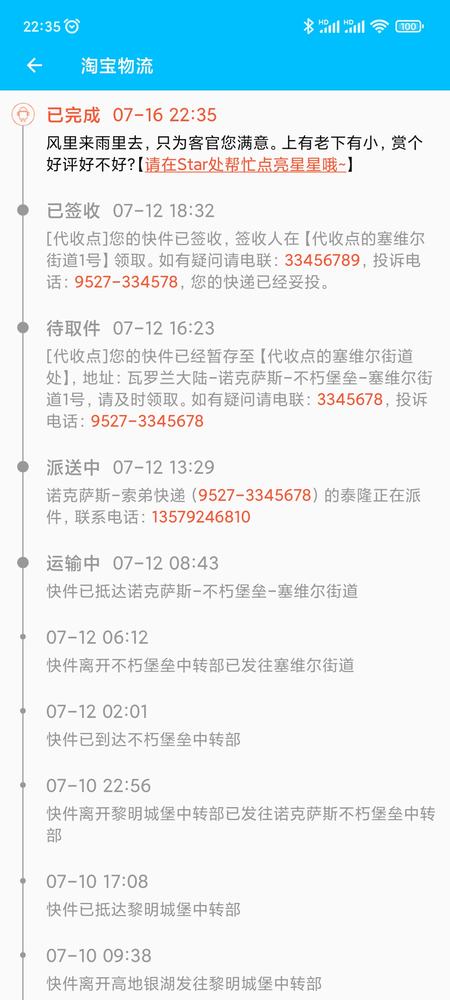
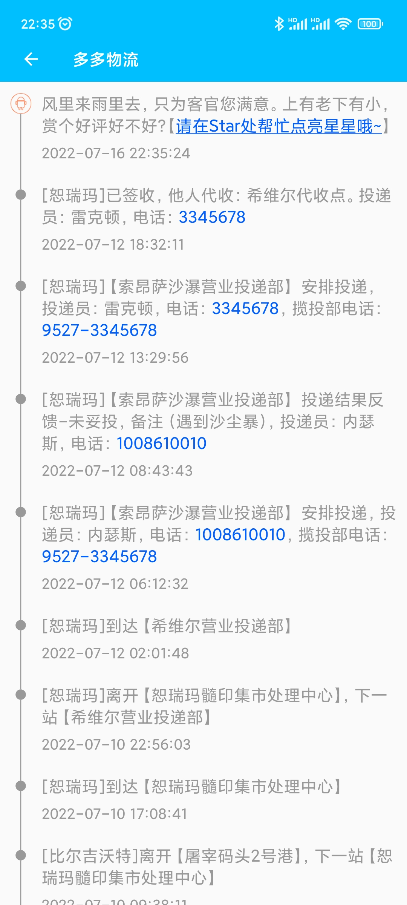

## RecyclerView.ItemDecoration

    


### 一、前言


&emsp;&emsp;前段时间刚接触到RecyclerView的ItemDecoration，于是想学习一下。下文将围绕“物流时间线”对ItemDecoration进行详细的分析，“物流时间线”的效果图如下：

<center class="half">
	
    
</center>

<center class="half">
	
    
</div>


### 二、ItemDecoration


&emsp;&emsp;顾名思义，ItemDecoration是对列表进行装饰的，简单的列表样式可以直接在布局文件中就搞定了，例如分割线。但当需求比较复杂时，例如“物流”这种列表就不适用了。

&emsp;&emsp;ItemDecoration的原理是通过改变item的边距从而腾出空间，然后在这些空间中绘制装饰的内容。所以如果要使用ItemDecoration，需要对自定义View有一些了解，最起码会用canvas+paint绘制一些简单的东西。


#### 2.1 ItemDecoration的关键方法


&emsp;&emsp;ItemDecoration有几个比较重要的方法，下面我们逐一分析这些方法的作用和用法。


#### 2.1.1 getItemOffsets


```kotlin
override fun getItemOffsets(
    outRect: Rect,
    view: View,
    parent: RecyclerView,
    state: RecyclerView.State
)
```

这个方法主要是设置Item的上下左右边距，直接设置outRect的上下左右就可以了。例如设置左边边距为50像素：outRect.left= 50。具体效果可以看我盗的这张图，如下：


(<font color="red">注：Rect的set方法参数：set(left, top, right, bottom)</font>)


&emsp;&emsp;我们在这个方法中，设置了列表的边距，多出来的空间就可以用来绘制装饰的东西了。


#### 2.1.2 onDraw


```kotlin
override fun onDraw(
	c: Canvas, 
	parent: RecyclerView, 
	state: RecyclerView.State
)
```

这个方法和View的onDraw一样，画就完了。不同的是，在这个方法里应该遍历parent的子view来画，即为每一个item都加上装饰。代码如下：

```kotlin
for (i in 0 until parent.childCount) {
	...
}
```


#### 2.1.3 onDrawOver


```kotlin
override fun onDrawOver(
    c: Canvas, 
    parent: RecyclerView, 
    state: RecyclerView.State
)
```
这个方法也是绘制的，和onDraw唯一的区别就是调用顺序，简单来说：
- onDraw 绘制的东西如果与item重叠，则重叠区域被item覆盖；
- onDrawOver 绘制的东西如果与item重叠，则重叠区域被onDrawOver覆盖。

一般来说只需要重写onDraw方法即可，onDrawOver用得比较少。


### 2.2 实战


#### 2.2.1 需求分析


&emsp;&emsp;参考了几大网购平台的App物流页面，大多都是在列表的左边进行装饰。每个item都有一个小圆点或图标或大圆点，而且都与item的第一行文字水平对齐（<font color="red">注意，是item的第一行文字！！！</font>），如下图所示：


这是一个难点，也是唯一有点难度的地方，因为我们需要“精通”几何学才能解决这个问题，当然，能够熟练地使用“几何桶”也是可以的，哈哈哈。有问题就要解决问题，我们写代码的目的就是先写bug，再解决bug，如下图：


上图中，就是没有计算好坐标，所以出现了问题。


#### 2.2.2 实现


经过我一通胡编乱造的分析后，可以确定几个问题：

- item留出左边的空间
- 确定每个节点的y坐标
- 绘制时间线和节点圆

因此我们在getItemOffsets方法中，只要左边有空间即可，代码如下：

```kotlin
override fun setOutRect(outRect: Rect) {
	outRect.set(dp2px(DECORATION_START), 0, 0, 0)
}
```


这样便在item的左边腾出一些空间（30dp）来绘制时间线了，先来看一下添加ItemDecoration和不添加的区别：

<center class="half">
	
	
</center>

上图（左）中红色区域就是绘制我们绘制的地方，因为时间线的X坐标始终不变，所以只需要计算每一个节点的y坐标就可以了。在计算之前，先来看一下布局文件，代码如下：

```xml
<?xml version="1.0" encoding="utf-8"?>
<RelativeLayout xmlns:android="http://schemas.android.com/apk/res/android"
    android:layout_width="match_parent"
    android:layout_height="wrap_content"
    android:paddingTop="10dp"
    android:paddingBottom="10dp"
    android:background="@color/black"
    >
    <LinearLayout
        android:id="@+id/lyt_title_body"
        android:layout_width="wrap_content"
        android:layout_height="wrap_content"
        android:orientation="horizontal"
        android:layout_alignParentTop="true"
        android:layout_alignParentStart="true"
        android:layout_alignParentEnd="true"
        android:background="#ff00ff00"
        >
        <TextView
            android:id="@+id/tv_state"
            android:layout_width="wrap_content"
            android:layout_height="wrap_content"
            android:text="已签收"
            android:textSize="@dimen/text_title"
            android:textColor="@color/color_taobao_selected_title"
            android:textStyle="bold"
            android:layout_marginEnd="10dp"
            android:background="@color/white"
            />
        <TextView
            android:id="@+id/tv_date"
            android:layout_width="wrap_content"
            android:layout_height="wrap_content"
            android:text="01-01 12:00"
            android:textSize="@dimen/text_title"
            android:textColor="@color/color_taobao_selected_title"
            android:layout_gravity="center_vertical"
            android:background="@color/purple_500"
            />
    </LinearLayout>
    <TextView
        android:id="@+id/tv_desc"
        android:layout_width="wrap_content"
        android:layout_height="wrap_content"
        android:text="巴拉巴拉巴拉巴拉"
        android:textSize="@dimen/text_desc"
        android:textColor="@color/color_taobao_selected_desc"
        android:layout_alignParentStart="true"
        android:layout_alignParentEnd="true"
        android:layout_below="@id/lyt_title_body"
        android:layout_marginTop="4dp"
        android:background="#ff0"
        />
</RelativeLayout>
```

效果图如下：


在onDraw方法中，传给我们一个参数：parent，而parent的每一个childView都是一个RelativeLayout，而RelativeLayout的子view就和布局文件一样了。要计算y坐标，我们就得找到第一行文字是在哪个View中。很明显，第一行文字是tvState和tvDate，因为tvState有时候是不可见的，所以我们直接找到tvDate就可以了。代码如下：

```kotlin
val itemView = parent.getChildAt(0) as ViewGroup
val childView = itemView.getChildAt(0) as ViewGroup
val grandSonView = childView.getChildAt(1) as TextView
```

拿到了tvDate，就可以计算第一行文字的所在位置，textView中，有一个方法可以获取文字的所在位置，如下：

```kotlin
textView.getLineBounds(0, rect)
```

因为textView的文字可能是多行，而我们只要第一行的，所以传0即可，getLineBounds方法会把计算结果存放到rect中。需要注意的是，rect的位置是相对于tvDate的，而tvDate的位置是相对于LinearLayout的，LinearLayout的位置又是相对于RelativeLayout的，RelativeLayout的位置又是相对于RecyclerView的。要计算节点圆的y坐标，都必须参考这些相对位置信息，否则计算出来的位置是一个绝对位置，绝对位置是不会变的，所以上图中第一个节点圆不会随着item的滑动而移动。因此最终的y坐标计算如下：

```kotlin
val y = itemView.top + childView.top + grandSonView.top + rect.centerY().toFloat()
```

到这里基本上就没什么问题了，下面只需要根据实际需求写代码就OK了。

